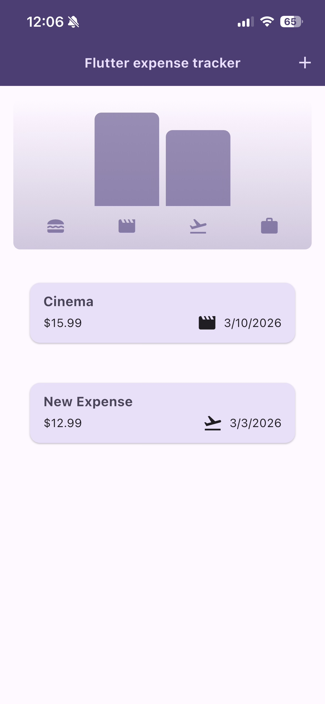

# Flutter Expense Tracker

A simple **Flutter application for tracking personal expenses**.  
The app allows users to add, view, and categorize expenses with a clean and minimal interface.

## Features

- Add new expenses with title, amount, category, and date
- View a list of all recorded expenses
- Categorize expenses (Food, Travel, Cinema, Work, etc.)
- Simple expense visualization with charts
- Clean and responsive Flutter UI

## Technologies Used

- Flutter
- Dart
- Material Design components

## Screenshots

### Home Screen

### Add Expense

